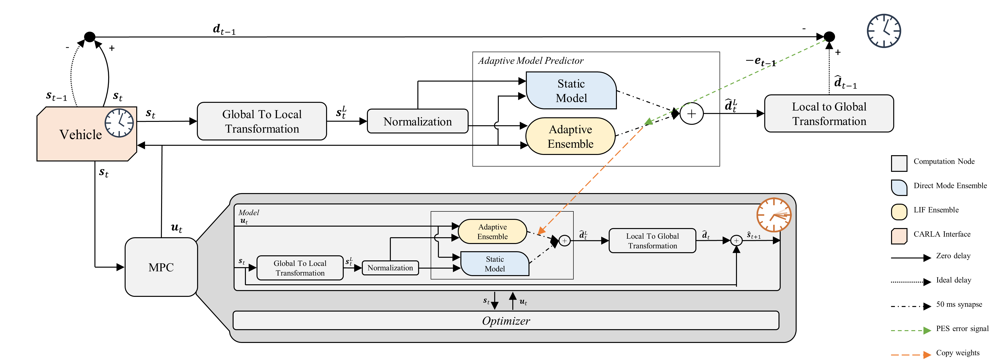

# Continuous Adaptive Nonlinear Model Predictive Control Using Spiking Neural Networks

This repository contains the source code and figures of our paper.




## Paper Details

**Title:** Continuous Adaptive Nonlinear Model Predictive Control Using Spiking Neural Networks

**Abstract:** This paper introduces a novel continuous adaptive non-linear Model Predictive Control (MPC) approach using Spiking
Neural Networks (SNNs) for controlling dynamic systems. This approach addresses challenges related to the dependency of
MPC on accurately modeling complex system dynamics. Our approach significantly reduces dynamic error and augments
model accuracy, while simultaneously addressing unforeseen situations. The model’s efficacy has been meticulously tested
under standard, malfunctioning steering, and swift malfunctioning steering scenarios, measuring its performance against
traditional MPC controllers with a fixed model. The results reveal significant improvements in dynamic error; up to 89.87%
with only 5 spiking neurons and up to 96.95% with 5000. These promising results pave the way for novel applications in
real-time control and stimulate further studies in the adaptive control realm utilizing spiking neural networks.

**Authors:** Raz Halaly, Elishai Ezra Tsur

**Keywords:** autonomous driving, neuromorphic control, spiking neural networks (SNN), model predictive control (MPC), neural engineering framework (NEF), energy efficiency, motion planning, computational frameworks

**Publication:** TBD

## Table of Contents

1. [Installation](#installation)
2. [Usage](#usage)
3. [Data](#data)
4. [Citation](#citation)
5. [License](#license)

## Installation

Follow these steps to set up and run the project:

### Prerequisites
- Python 3.7
- [CARLA Simulator 0.9.14](https://github.com/carla-simulator/carla/releases/tag/0.9.14)
- (Windows) [Visual C++ Redistributable 17 (2022)](https://learn.microsoft.com/en-us/cpp/windows/latest-supported-vc-redist?view=msvc-170#visual-studio-2015-2017-2019-and-2022)


### Step 1: Install CARLA Simulator

Download and install CARLA Simulator 0.9.14 by following the instructions provided in their [official documentation](https://carla.readthedocs.io/en/latest/start_quickstart/). If you are using Windows, make sure to install the [Visual C++ Redistributable 17 (2022)](https://learn.microsoft.com/en-us/cpp/windows/latest-supported-vc-redist?view=msvc-170#visual-studio-2015-2017-2019-and-2022) as well.

### Step 2: : Install Python dependencies

Navigate to the `src` directory of the cloned repository:

```bash
cd ./src
```

Install the required Python packages using pip:

```bash
pip install -r requirements.txt
```

> **_NOTE:_**  It is highly recommended to use virtual environment for installing the Python dependencies. For more information, see [Python Virtual Environments Documentation](https://docs.python.org/3/tutorial/venv.html).


## Usage

1. Start the CARLA Simulator by following the instructions provided in their [official documentation](https://carla.readthedocs.io/en/latest/start_quickstart/#running-carla).

2. Navigate to the `src` directory of the cloned repository:

    ```bash
    cd ./src
    ```
3. Run the `run_experiment.py` script:

    ```bash
    python run_experiment.py
    ```

    The script accepts several command line arguments: 
    ```
    run_experiment.py [-h|--help] 
                      [--host HOST] 
                      [--port PORT] 
                      [--car CAR]
                      [--map MAP] 
                      [--waypoints WAYPOINTS]
                      [--predict-dt PREDICT_DT]
                      [--predict-horizon PREDICT_HORIZON]
                      [--synapse SYNAPSE] 
                      [--look-ahead LOOK_AHEAD]
                      [--road-degree ROAD_DEGREE]
                      [--learning-rate LEARNING_RATE]
                      [--predictor-neurons PREDICTOR_NEURONS]
                      [--steering-malfunction STEERING_MALFUNCTION]
                      [--simulation-time SIMULATION_TIME]
                      [--waypoints-resolution WAYPOINTS_RESOLUTION]
                      [--swift SWIFT]
    ```

    Where the arguments are:
    | Argument | Default Value | Description |
    | --- | --- | --- |
    | `-h`, `--help` | | Show the help message and exit. |
    | `--host HOST` | `localhost` | IP address of the CARLA Simulator host. |
    | `--port PORT` | `2000` | TCP port of the CARLA Simulator host. |
    | `--car CAR` | `vehicle.tesla.model3` | The vehicle model to use. See [CARLA Catalogue](https://carla.readthedocs.io/en/latest/catalogue_vehicles/) for a list of available models. |
    | `--map MAP` | `Town04` | The map to use. |
    | `--waypoints WAYPOINTS` | `1,369,55,320,323,0` | The waypoints to use as a list of spawn points ids. |
    | `--predict-dt PREDICT_DT` | `0.1` | The prediction time step. |
    | `--predict-horizon PREDICT_HORIZON` | `5` | The prediction horizon. |
    | `--synapse SYNAPSE` | `0.05` | The synapse time constant. |
    | `--look-ahead LOOK_AHEAD` | `60` | The look ahead distance in meters. |
    | `--road-degree ROAD_DEGREE` | `3` | The degree of polynomial to fit to road. |
    | `--learning-rate LEARNING_RATE` | `1e-4` | The learning rate. |
    | `--predictor-neurons PREDICTOR_NEURONS` | `1000` | The number of neurons in adaptive predictor. |
    | `--steering-malfunction STEERING_MALFUNCTION` | `0.25` | The steering malfunction. |
    | `--simulation-time SIMULATION_TIME` | `60` | The simulation time in seconds. |
    | `--waypoints-resolution WAYPOINTS_RESOLUTION` | `1` | The waypoints resolution in meters. |
    | `--swift SWIFT` | `0` | The swift malfunction direction every n seconds. 0 or negative to disable. |

    The script is configured to run the experiment `Experiment II` from the paper. To run `Experiment I` use:
    
    ```
    python run_experiment.py --steering-malfunction 0.0 --car <vehicle-blueprint>
    ```

    The arguments for `Experiment III` are:
    
    ```
    python run_experiment.py --map Town06 --waypoints 263,7,55,314 --simulation-time 40 --swift 10 --car <vehicle-blueprint>
    ```
    
## Data

The recorded data from the experiments can be found in the this [OneDrive folder](https://365openu-my.sharepoint.com/:f:/g/personal/haraz3_365_openu_ac_il/EqgqcgEFFQdIif6hc8t-86cB6tAXWiheASKuyvfydostCg?e=xuKzTN). The data is organized in the following structure:

```bash
├───Experiment I
│   ├───...
├───Experiment II
│   ├───...
├───Experiment III
│   ├───...
├───waypoints_town04.csv
└───waypoints_town06.csv
```

Each folder contains the logs from the experiment in CSV format. The CSV files names are in the following format:

```
state_log_<prediction-horizon>_<prediction-time-step>_<car-model>_[norm|steermal=<value>]_[bicycle|adaptive_<neurons>_<synapse>_<learning_rate>]
```

Each CSV file contains the following columns:

| Column | Description |
| --- | --- |
| `px` | The x position of the vehicle in meters. |
| `py` | The y position of the vehicle in meters. |
| `yaw_cos` | The cosine of the yaw angle of the vehicle. |
| `yaw_sin` | The sine of the yaw angle of the vehicle. |
| `vx` | The x velocity of the vehicle in meters per second. |
| `vy` | The y velocity of the vehicle in meters per second. |
| `ax` (Adaptive only) | The x acceleration of the vehicle in meters per second squared. |
| `ay` (Adaptive only) | The y acceleration of the vehicle in meters per second squared. |
| `vr` (Adaptive only) | The yaw rate of the vehicle in radians per second. |
| `dx_err` | The prediction error in the x position of the vehicle in meters. |
| `dy_err` | The prediction error in the y position of the vehicle in meters. |
| `dyaw_err` | The prediction error in the yaw angle of the vehicle. |
| `dvx_err` | The prediction error in the x velocity of the vehicle in meters per second. |
| `dvy_err` | The prediction error in the y velocity of the vehicle in meters per second. |
| `dax_err` (Adaptive only) | The prediction error in the x acceleration of the vehicle in meters per second squared. |
| `day_err` (Adaptive only) | The prediction error in the y acceleration of the vehicle in meters per second squared. |
| `dvr_err` (Adaptive only) | The prediction error in the yaw rate of the vehicle in radians per second. |
| `predict_cost` | The prediction cost. |

The `waypoints_town04.csv` and `waypoints_town06.csv` files contain the waypoints used in the experiments.

## Citation

If you use our work in your research, please cite it using the following BibTeX entry:

```bibtex
TBD
```


## License

MIT License